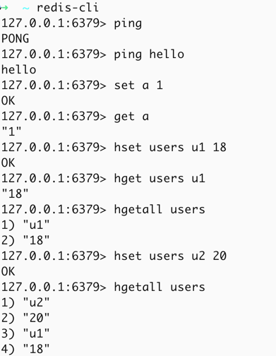

# redis-go

Redis written in Go

## 介绍

- 用Go语言从头构建redis
- 遵循“我无法创造的东西，我就不理解”的原则，尝试写了该项目
- 尽量不会使用任何外部库，因为我们需要的一切都在 Go 本身中可用
- 编写的服务器将与 Redis 兼容，任何能与 Redis 通信的客户端都能够与我们的服务器通信
- 这里没有构建redis的全部功能，是现主要常用功能，其他功能可以后续扩展，当前主要实现以下功能：
    - 构建一个 Redis，允许您使用字符串和哈希。
    - 编写一个解析器来理解RESP，它允许服务器接收命令并做出响应。
    - 使用 go 协程同时处理多个连接。
    - 使用追加文件 (AOF)将数据写入磁盘，这是 Redis 用于持久化的方法之一。这样，如果服务器崩溃或重启，我们就可以恢复数据。

## 测试

- 